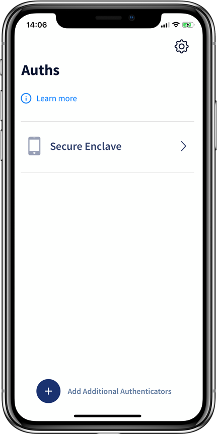
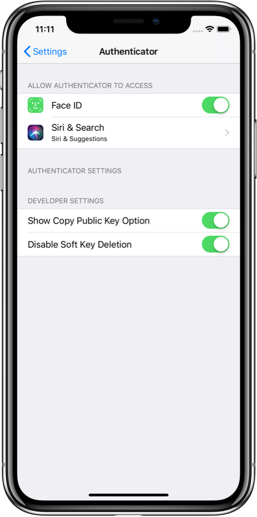
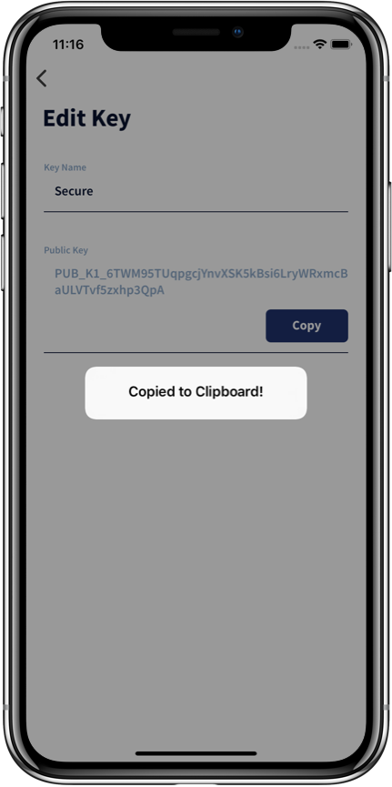
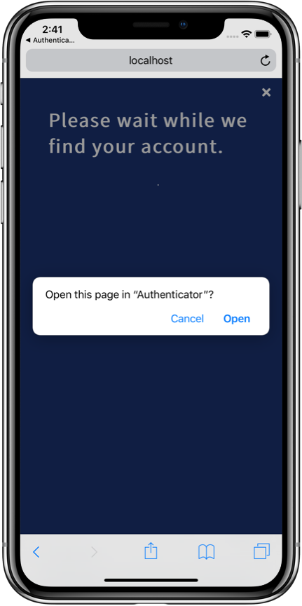
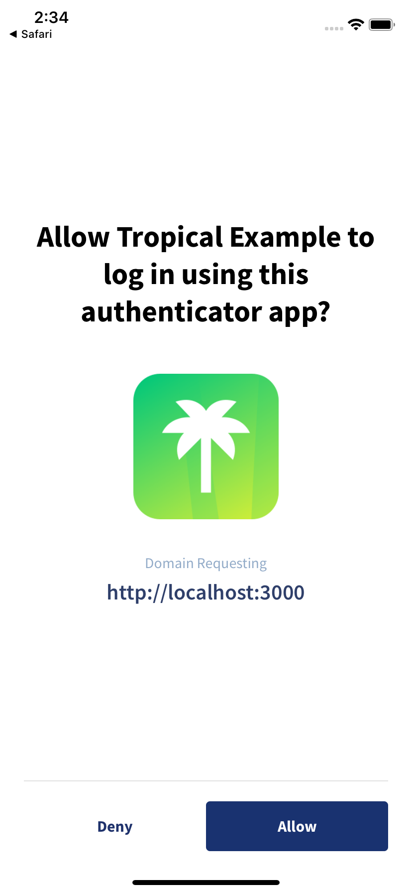
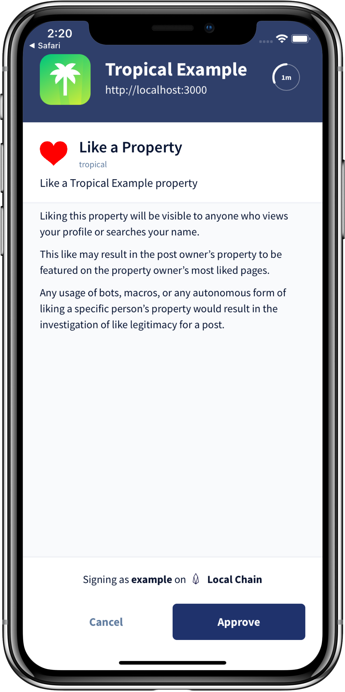
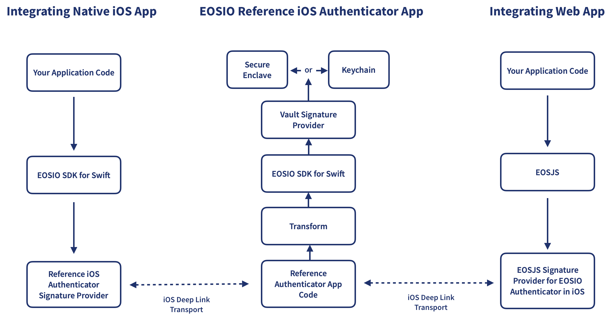
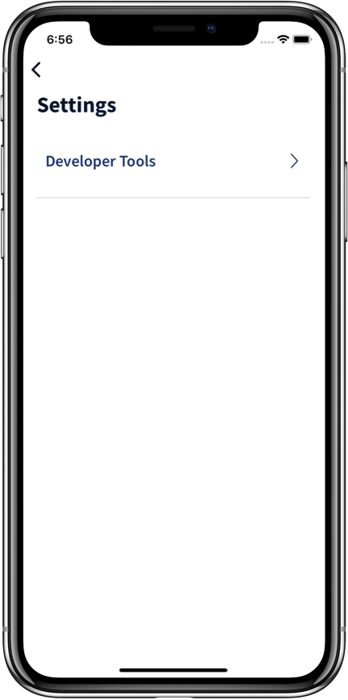
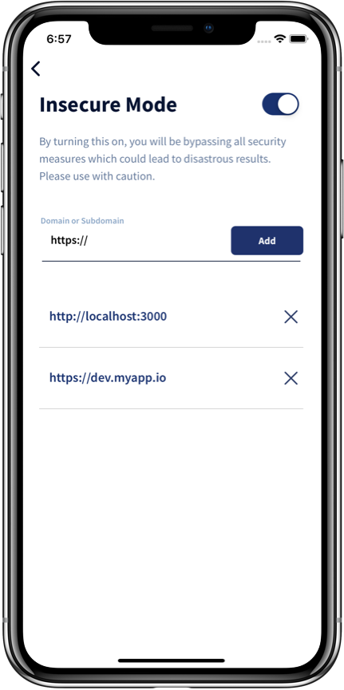

# EOSIO Reference iOS Authenticator App

An iOS app demonstrating inter-application signing of transactions using various EOSIO Labs specifications and technologies. Transactions can be proposed from:
* web applications running in Mobile Safari
* other native iOS apps using [EOSIO SDK for Swift](https://github.com/EOSIO/eosio-swift)

Signing from Mobile Safari | Signing from Native App
:---: | :---:
 | 

## About EOSIO Labs
EOSIO Labs repositories are experimental. Developers in the community are encouraged to use EOSIO Labs repositories as the basis for code and concepts to incorporate into their applications. Community members are also welcome to contribute and further develop these repositories. Since these repositories are not supported by Block.one, we may not provide responses to issue reports, pull requests, updates to functionality, or other requests from the community, and we encourage the community to take responsibility for these.

## Contents
* [Introduction](#introduction)
  * [Overview](#overview)
  * [Definitions](#definitions)
  * [Related Reading](#related-reading)
* [Prerequisites](#prerequisites)
* [Installation](#installation)
* [First Use](#first-use)
  * [On Device](#on-device)
  * [In the Simulator](#simulator)
* [Getting Started with an Example Web App](#getting-started-with-an-example-web-app)
* [Usage](#usage)
  * [How to Accept a Selective Disclosure Request](#how-to-accept-a-selective-disclosure-request)
  * [How to Sign Transactions](#how-to-sign-transactions)
* [Configuring Apps to Work with EOSIO Reference iOS Authenticator App](#configuring-apps-to-work-with-eosio-reference-ios-authenticator-app)
  * [Prerequisites](#prerequisites)
  * [Integrating Native iOS Apps Using EOSIO SDK for Swift](#integrating-native-ios-apps-using-eosio-sdk-for-swift)
  * [Integrating Web Apps from Mobile Safari](#integrating-web-apps-from-mobile-safari)
* [Architecture](#architecture)
  * [Data Flow](#data-flow)
  * [Restricted Chain/Node Communication](#restricting-reference-ios-authenticator-app-communication-with-chainsnodes)
  * [Manifest Specification](#manifest-specification)
  * [Assert Contract](#assert-contract)
  * [Security](#security)
  * [Insecure Mode](#insecure-mode)
* [Contributing](#contributing)
* [License & Legal](#license)

## Introduction
### Overview
The EOSIO ecosystem is rich with existing wallets providing users the ability to sign transactions on the EOSIO blockchain. However, we have identified some limitations and possible areas for improvement to the overall user experience:

* Lack of support for chains other than Mainnet.
* Lack of support for richly displaying Ricardian Contracts.
* Lack of transparency and verification of application's identity and intentions, especially during transaction signing.
* Lack of support for inter-application transaction signing on native mobile devices. Most mobile wallets restrict integrating app developers to a mobile web application form factor and force users to access integrating apps within a blockchain-only browser.
* Dependence on users to know enough information about the chain they are transacting on to be able to set up a network in the wallet. Even more, dependence on users to know they are transacting on a blockchain in the first place.

This reference implementation is one of two examples (see also the [EOSIO Reference Chrome Extension Authenticator App
](https://github.com/EOSIO/eosio-reference-chrome-extension-authenticator-app)) for wallet developers and presents possible solutions to the problems above using a native iOS Authenticator application. The EOSIO Reference iOS Authenticator App provides the following features, as examples:

* It enables seamless, multi-network support. In fact, the app, itself, does not even communicate with chains or nodes directly.
* It _securely_ stores private keys and employs the use of biometrics to signs transactions.
* It displays richly-formatted [Ricardian Contracts](https://github.com/EOSIO/ricardian-spec), which provide users with a human-readable explanation of the action(s) the app is proposing and allows users to approve or reject the terms of the contract(s).
* By following the [Manifest Specification](https://github.com/EOSIO/manifest-spec), the Reference Authenticator App displays metadata about the requesting application to end users any time they are prompted to trust an app or sign a transaction from one. This provides users with an improved sense of trust in the requesting application and the signing ceremony itself. The Reference Authenticator App also runs various transaction pre-flight security checks, comparing the contents of a transaction request with what integrating apps have declared about themselves.

### Definitions
* _Reference App_, _Authenticator App_, _Reference iOS Authenticator App_: This app, the EOSIO Reference iOS Authenticator App.
* _Integrating App_, _Requesting App_: Native iOS apps or web applications that request public keys or the signing of transactions from this EOSIO Reference iOS Authenticator App.
* _Authenticator_, _Auth_: Public and/or private keys.

### Related Reading
This is just one of several thought leadership works focusing on wallets, key management and authentication, and the relating user experience. For more context and related reading, check out these these pieces:

* [A Passwordless Future: Building Towards More Secure and Usable Authentication Systems](https://medium.com/eosio/a-passwordless-future-building-towards-more-secure-and-usable-authentication-systems-e188f07e4b87)
* [EOSIO Authentication Transport Protocol Spec](https://github.com/EOSIO/eosio-authentication-transport-protocol-spec)
* [EOSIO Software Release: Ricardian Contract Specifications and the Ricardian Template Toolkit](https://medium.com/eosio/eosio-software-release-ricardian-contract-specifications-and-the-ricardian-template-toolkit-a0db787429d1)
* [EOSIO Manifest Specification](https://github.com/EOSIO/manifest-spec)
* [EOSIO Labs™ Release: The Universal Authenticator Library (UAL) — Increasing the Accessibility of Blockchain Applications](https://medium.com/eosio/eosio-labs-release-the-universal-authenticator-library-ual-increasing-the-accessibility-of-8e2bd62a78a5)

## Prerequisites
* Xcode 10+
* iOS 12+
* CocoaPods v1.5.3+
* Touch ID or Face ID must be enabled and you must be enrolled

## Installation
1. Clone this repo and ensure you are on the `master` branch
1. Run a `pod install`.
1. Open the `.xcworkspace` in Xcode.
1. Change the bundle identifier from `one.block.eosio` to a new bundle identifer of your choice.
1. Under `Capabilities, App Groups`, select an app group from your Apple developer account.
1. In the `Constants` class set `vaultAccessGroup` to your app group.
1. Build and Run the project.

## First Use
### On Device
Assuming you have met the prerequisites above and are enrolled in biometrics, a new Secure Key will be created for you the first time you run the application. This private key resides in the Secure Enclave and is not, of course, associated with any blockchain account yet.

  

At this point, you have a couple of options:
* **Add a new Authenticator** (key) to the app using the "Add Additional Authenticators" button at the bottom of the Auths screen. (This should be a private key already on your EOSIO account.)
* **Use the newly-generated Secure key**. If you go this route, you will need to enable "Show Copy Public Key Option" in iOS Settings > Authenticator (see screenshot below), copy the key, and use another tool, such as [Cleos](https://developers.eos.io/eosio-cleos/reference), to add the key to your blockchain account.

  
  

### Simulator
If you are running the app in Simulator, ensure that you are "Enrolled" in Touch ID or Face ID. (`Hardware` > `Face ID` > `Enrolled`) or (`Hardware` > `Touch ID` > `Enrolled`). You will then be required to import a new private key if you haven't already done so on that particular Simulator instance.

When signing transactions on Simulator, you will be prompted for biometrics. Similar to enrolling above, when prompted, you will need to navigate to the same menu and select `Matching Face` or `Matching Touch` to approve.

## Getting Started with an Example Web App
If you want to start out by test driving the EOSIO Reference iOS Authenticator App for yourself, we recommend checking out our [Tropical Example web app](https://github.com/EOSIO/tropical-example-web-app/). Tropical Example is a mock web application for renting properties and provides instructions and a script for setting up a local chain bootstrapped with all of the necessary, compliant contracts for making the experience work.

Specifically, follow the instructions under the [Running Tropical Example](https://github.com/EOSIO/tropical-example-web-app/#running-tropical-example) header. (Of course, we recommend reading the rest of the README there too, which will provide more context around how the pieces work together to provide the user with a secure and positive user experience.)

One **important note** to keep in mind: the web application and local blockchain will both be running on `localhost`, so you will need to use the EOSIO Reference iOS Authenticator App in the [Simulator](#simulator) running on the same machine for this particular example web app.

## Usage
* [Accept a Selective Disclosure Request](#how-to-accept-a-selective-disclosure-request)
* [Sign Transactions](#how-to-sign-transactions)

### How to Accept a Selective Disclosure Request

A [Selective Disclosure Request](https://github.com/EOSIO/internal-eosio-authentication-transport-protocol-spec#selective-disclosure-request) is akin to a signature provider's `getAvailableKeys()` call. In fact, in most cases, that's exactly what is happening under the hood.

1. From an app that supports integration with the iOS Authenticator App, attempt to login or take some action that will kick off a transaction signing request.
2. iOS may ask you if you want to open Authenticator. Choose "Open."

  

3. iOS will switch you over to the EOSIO Reference iOS Authenticator App where you will be presented with the Selective Disclosure request. The information from this selective disclosure comes from the [metadata associated with the application manifest](https://github.com/EOSIO/manifest-spec). You can either Allow or Deny this request.

  

4. If the request is allowed, the Reference iOS Authenticator App will return your public keys to the requesting application. In most cases, these will be cached for a period of time by the requesting application or until you log out. Subsequent `getAvailableKeys()` calls usually pull from this cache without triggering another Selective Disclosure request, unless the user has previously logged out of the requesting application.

### How to Sign Transactions
1. From an app that supports integration with the iOS Authenticator App, attempt to execute some action that requires a signature.
2. The Reference iOS Authenticator App will open a view with the transaction request, including the Ricardian Contracts of the actions. You can either Approve or Cancel this request.

  

3. If the user allows the request, they will be prompted for biometric confirmation.
4. Assuming the user authenticates biometricly, the transaction will be signed with the keys from the Secure Enclave and/or Keychain.
5. The transaction and signatures will be returned to the requesting app, which may, in turn, broadcast the transaction to the chain. (Most of the tooling broadcasts by default.)

## Configuring Apps to Work with EOSIO Reference iOS Authenticator App
The Reference Authenticator Apps follow the [EOSIO Auth Transport Protocol](https://github.com/EOSIO/eosio-authentication-transport-protocol-spec) specification defining inter-application transports and the payloads sent over those transports.

There is some configuration needed in the integrating app, and there are a few different ways to interact with the iOS Authenticator App from an integrating web or native app.

### Prerequisites
* Your app must conform to the [Manifest Specification](https://github.com/EOSIO/manifest-spec).
* Contracts for any action included in a transaction by your app must include a Ricardian contract conforming with the [Ricardian Specification](https://github.com/EOSIO/ricardian-spec).
* Chains on which you wish to transact must have the [`eosio.assert` contract](#assert-contract) deployed and a chain name and icon declared.
* Apps must be served over HTTPS or locally from `localhost`.

### Integrating Native iOS Apps Using EOSIO SDK for Swift
Configure the [EOSIO SDK for Swift](https://github.com/EOSIO/eosio-swift) `EosioTransaction` with the [Reference iOS Authenticator Signature Provider](https://github.com/EOSIO/eosio-swift-reference-ios-authenticator-signature-provider).

See the [Basic Usage](https://github.com/EOSIO/eosio-swift#basic-usage) documentation in the EOSIO SDK for Swift repo for instructions on configuring EOSIO SDK for Swift with a signature provider.

Additionally, refer to [Reference iOS Authenticator Signature Provider](https://github.com/EOSIO/eosio-swift-reference-ios-authenticator-signature-provider) README for more information around using that signature provider to interact with the EOSIO Reference iOS Authenticator App.

### Integrating Web Apps from Mobile Safari
Choose a solution for interacting with the Reference iOS Authenticator App:

1. Use the [Universal Authenticator Library](https://github.com/EOSIO/universal-authenticator-library) and the [UAL for EOSIO Reference Authenticator](https://github.com/EOSIO/ual-eosio-reference-authenticator) (_easiest_).
    * UAL will detect that the app is running in Mobile Safari on iOS and will configure EOSJS with a signature provider facilitating communication between the web app and the Authenticator App.
    * Read the documentation on the [Tropical example app](https://github.com/EOSIO/tropical-example-web-app) to learn how to use the UAL.
1. Directly instantiate [EOSJS](https://github.com/EOSIO/eosjs) with the [EOSJS Signature Provider for EOSIO Authenticator in iOS](https://github.com/EOSIO/eosjs-ios-browser-signature-provider-interface).
    * This class implements the EOSJS Signature Provider interface. The documentation describes how to utilize it directly with EOSJS.
1. Directly use the iOS Deep Linking API.
    * The integrating app will need to post requests and listen for responses following the [EOSIO Auth Transport Protocols](https://github.com/EOSIO/eosio-authentication-transport-protocol-spec) envelope formats:
      * Requests: [URL Query String Payload](https://github.com/EOSIO/eosio-authentication-transport-protocol-spec#url-query-string-payload) transport
      * Responses: [URL Hash Fragment Identifier](https://github.com/EOSIO/eosio-authentication-transport-protocol-spec#url-hash-fragment-identifier) transport

## Architecture
### Data Flow

  

Under the hood, integrating apps interact with the EOSIO Reference iOS Authenticator App through the [iOS Deep Link](https://developer.apple.com/documentation/uikit/core_app/allowing_apps_and_websites_to_link_to_your_content/defining_a_custom_url_scheme_for_your_app) transport and the [EOSIO Authentication Transport Protocol](https://github.com/EOSIO/internal-eosio-authentication-transport-protocol-spec). However, that communication is generally abstracted away from app developers by the appropriate signature providers:
* [EOSIO SDK for Swift: Reference iOS Authenticator Signature Provider](https://github.com/EOSIO/eosio-swift-reference-ios-authenticator-signature-provider) for native iOS apps
* [EOSJS Signature Provider for EOSIO Authenticator in iOS](https://github.com/EOSIO/eosjs-ios-browser-signature-provider-interface) for web apps using [EOSJS](https://github.com/EOSIO/eosjs)

Web applications using the [Universal Authenticator Library](https://github.com/EOSIO/universal-authenticator-library) will find it easiest to use the [UAL for EOSIO Reference Authenticator](https://github.com/EOSIO/ual-eosio-reference-authenticator), which allows web apps to work with both this app on iOS and [its Chrome Extension counterpart](https://github.com/EOSIO/eosio-reference-chrome-extension-authenticator-app).

Internally, the iOS Authenticator App uses [EOSIO SDK for Swift](https://github.com/EOSIO/eosio-swift) along with the [EOSIO SDK for Swift: Vault Signature Provider](https://github.com/EOSIO/eosio-swift-vault-signature-provider) to get available keys from and sign with the device's Secure Enclave or the Keychain.

While the flowchart above emphasizes the _request_ lifecycle, simply reverse the arrows and you have the _response_ path. The transaction is signed in the Secure Enclave and/or Keychain, sent back to the Reference iOS Authenticator App via EOSIO SDK for Swift, and back through the iOS Deep Link Transport via the callback URL specified in the original request, eventually reaching all the way back to requesting app and user.

### Restricting Reference iOS Authenticator App Communication with Chains/Nodes
The EOSIO Reference iOS Authenticator App _does not directly communicate with any EOSIO chains or nodes_. It is entirely chain unaware and relatively chain agnostic. In fact, there is no way to configure networks or RPC endpoints in the iOS app because it doesn't need them.

This simplicity presents an interesting challenge, though. The Authenticator App must display to the user information about what they're signing and information about the blockchain they're signing the transaction for. But where does that information come from if not from the chain directly?

The answer is that all of the information presented to the user at the time of Selective Disclosure and Transaction Signing comes in with the payload from the requesting application. But that presents another problem: how can we trust that the requesting/integrating app isn't providing false information to the user about what they're signing or the chain on which they're signing?

For this, we employ the Manifest Specification and the Assert Contract.

### Manifest Specification
The EOSIO Reference iOS Authenticator App adheres to the [Manifest Specification](https://github.com/EOSIO/manifest-spec). All [checks](https://github.com/EOSIO/manifest-spec#how-it-works) described in the Manifest Specification are validated by the iOS app.

### Assert Contract
As part of the Manifest Specification, the EOSIO Reference iOS Authenticator App will append an invisible-to-the-user [`eosio.assert::require` action](https://github.com/EOSIO/eosio-reference-chrome-extension-authenticator-app/blob/master/src/contracts/eosio.assert.abi.json#L52) with the following parameters:
   * `chain_params_hash`: Hash of the chain information from the [Application Metadata](https://github.com/EOSIO/manifest-spec#application-metadata-specification) for the chain defined in the request envelope.
   * `manifest_id`: Hash of the [Manifest](https://github.com/EOSIO/manifest-spec#application-manifest-spec) for the chain defined in the request envelope.
   * `actions`: An array of actions whitelisted in the Manifest.
   * `abi_hashes`: An array of the hashed ABIs included in the request envelope.

This action, with the above parameters, will be added to the transaction so that the chain can validate that these values match what is registered on chain. If any of these validations fails, the entire transaction will be rolled back and rejected.

This has another implication: block producers must deploy the `eosio.assert` contract and declare a chain name and chain icon.

**NOTE:** The addition of this `require` action can be overridden. But this must be done as part of the request from the requesting application _and_ in the iOS Authenticator App with the `addAssertToTransactions` security exclusion. See the [Insecure Mode](#insecure-mode) section for more information.

### Security
The EOSIO Reference iOS Authenticator App uses the platform-supplied Secure Enclave and Keychain to secure all private keys. Private keys stored in the Secure Enclave cannot even be known by the iOS Authenticator App itself.

### Insecure Mode
The EOSIO Reference iOS Authenticator App has a developer settings page that allows application developers to enable `Insecure Mode` in order to bypass various security measures for development purposes. Turning off security measures could lead to **DISASTROUS** results. :warning: ***USE THIS FEATURE WITH CAUTION***. :warning:

To enable `Insecure Mode` follow the steps below for both the iOS Authenticator Appp and the application being developed.

#### EOSIO Reference iOS Authenticator App
1. To enable `Insecure Mode`, tap on the settings cog icon in the upper right-hand corner.
1. Tap the "Developer Tools" entry.
1. Toggle "Insecure Mode" on.
1. Enter the application domain or subdomain in the input field and tap the "Add" button.

  
  

#### Integrating Application
The integrating application must add the [securityExclusions](https://github.com/EOSIO/eosio-authentication-transport-protocol-spec#securityexclusions-optional) options to the [Request Envelope](https://github.com/EOSIO/eosio-authentication-transport-protocol-spec#request-envelope) as part of the [EOSIO Transport Protocol](https://github.com/EOSIO/eosio-authentication-transport-protocol-spec#securityexclusions-optional).

If using the [UAL for EOSIO Reference Authenticator](https://github.com/EOSIO/ual-eosio-reference-authenticator), these can be [passed in along with the authenticator options during UAL instantiation](https://github.com/EOSIO/ual-eosio-reference-authenticator#supported-environments). The same applies when using the [EOSJS Signature Provider for EOSIO Authenticator in iOS](https://github.com/EOSIO/eosjs-ios-browser-signature-provider-interface) directly.

## Contributing

Interested in contributing? That's great! Here are some [Contribution Guidelines](./CONTRIBUTING.md) and the [Code of Conduct](./CONTRIBUTING.md).

## Suggested Contributions and Innovations
The following suggestions are beyond the scope of this limited thought leadership reference app. We encourage the community to contribute to this repo, or fork it and innovate!
* Apps facilitating onboarding of new Secure Enclave keys to users' accounts.
* Multi-device support and onboarding new devices: Could one device onboard another?
* If you lose your device(s), you lose your Secure Enclave keys. How can recovery be done without custodians?
* Support for Universal Links and other transports.
* Cross-platform signing. Could the [EOSIO Reference Chrome Extension Authenticator App](https://github.com/EOSIO/eosio-reference-chrome-extension-authenticator-app) on desktop trigger a push to sign from this iOS app?
* Autosigning/whitelisted actions. Via Push Notification? In the background?

## License

[MIT](./LICENSE)

## Important

See LICENSE for copyright and license terms.  Block.one makes its contribution on a voluntary basis as a member of the EOSIO community and is not responsible for ensuring the overall performance of the software or any related applications.  We make no representation, warranty, guarantee or undertaking in respect of the software or any related documentation, whether expressed or implied, including but not limited to the warranties of merchantability, fitness for a particular purpose and noninfringement. In no event shall we be liable for any claim, damages or other liability, whether in an action of contract, tort or otherwise, arising from, out of or in connection with the software or documentation or the use or other dealings in the software or documentation. Any test results or performance figures are indicative and will not reflect performance under all conditions.  Any reference to any third party or third-party product, service or other resource is not an endorsement or recommendation by Block.one.  We are not responsible, and disclaim any and all responsibility and liability, for your use of or reliance on any of these resources. Third-party resources may be updated, changed or terminated at any time, so the information here may be out of date or inaccurate.  Any person using or offering this software in connection with providing software, goods or services to third parties shall advise such third parties of these license terms, disclaimers and exclusions of liability.  Block.one, EOSIO, EOSIO Labs, EOS, the heptahedron and associated logos are trademarks of Block.one.

Wallets and related components are complex software that require the highest levels of security.  If incorrectly built or used, they may compromise users’ private keys and digital assets. Wallet applications and related components should undergo thorough security evaluations before being used.  Only experienced developers should work with this software.
